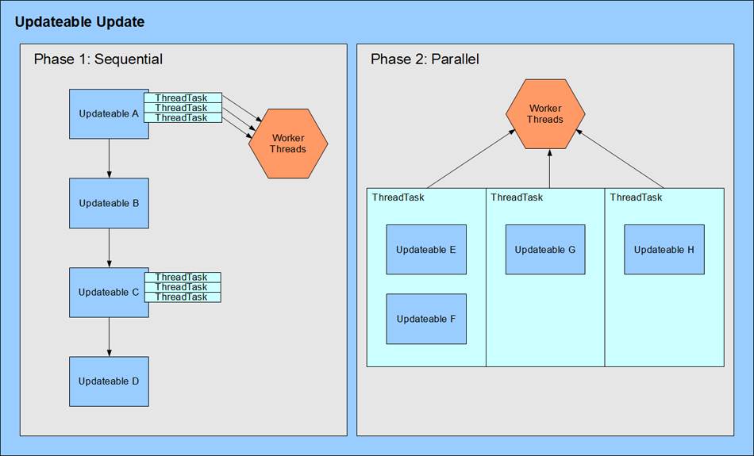

# **Internal Multithreading**

Easily harness multicore processors to speed up your simulation.

[Multithreading Demo](Isolated Demos/MultithreadingDemo)

## 1 | Getting Started

BEPUphysics supports the usage of an arbitrary number of threads. Modern PCs with multicore processors and the Xbox360 get a significant performance boost in over the sequential alternative.

As far as the engine is concerned, getting multithreading running is a very easy one-step process: pass an IParallelLooper into the Space constructor and it works.

### 1.A | The Parallel Looper

BEPUphysics uses threads through the IParallelLooper passed into the Space constructor. Every threaded job in the engine boils down to a simple for loop, so any implementation which can support threaded loops can be plugged in easily. The most common&nbsp;implementation of this interface is the ParallelLooper.

The ParallelLooper, specifically, offers an easy “AddThread” method that can be called to tell the engine to use another thread. As a user, no management of a Thread object is necessary. The thread is created and handled internally.&nbsp; When adding a thread, an initializing delegate can be specified. Usually, this is used on the Xbox360 to call Thread.CurrentThread.SetProcessorAffinity; more information about this can be found in section 1.D.

### 1.B | Work Distribution

When using IParallelLooper implementations which allow the customization of thread count (like the ParallelLooper), it's a good idea to add as many threads as there are free cores. Lower counts will result in idle cores, and higher counts will tend to suffer a little bit of overhead.

A Space will only use the threads of the IParallelLooper&nbsp;while inside the Space.Update method. This means, after the Update method, all of the processor power is free to do other things. In an otherwise sequential game, the engine can afford to use every processor. If the space is being updated asynchronously while some other components need processor power, care must be taken to ensure that bottlenecks are not being created.

### 1.C | Windows Threading

The thread scheduler on Windows can effectively determine which processor should work on a thread. The user can check how many processors/hardware threads are available by using the .NET framework's System.Environment.ProcessorCount property. Adding as many threads as processors exist generally works well, assuming there is more than one core.

### 1.D | Xbox360 Threading

Is someone out there really still targeting the Xbox360? If so, you should probably let me know you exist so I don't make your life pointlessly difficult by deleting certain things. That said...

On the Xbox360, threads should be given a particular location to run. Out of the Xbox's six available hardware threads, 0 and 2 are reserved by the XNA framework, leaving hardware threads 1, 3, 4 and 5 for other work. The thread affinity of a thread being added to a ParallelLooper can be specified by giving the AddThread method a delegate which sets the affinity using Thread.CurrentThread.SetProcessorAffinity.

There are two hardware threads per core on the Xbox, and both hardware threads 4 and 5 are on the same core.

Using four hardware threads puts two threads on the third physical core. The ParallelLooper implementation has fine-grained load balancing, so loading up every hardware thread tends to be a win. Other IParallelLooper implementations without strong load balancing may perform better with only three hardware threads.

## 2 | Extensible Types and Threading

Updateables and SolverUpdateables both interact with threading to provide options for speeding up custom types.

### 2.A | Updateable Threading

Updateables are a method for extending BEPUphysics. Each updateable has multiple stages which are called automatically at various points in the execution of the space's update. Updateables can work in three different ways with respect to threading:

*   Updateable does make use of worker threads and executes sequentially

*   Updateable does not make use of worker threads and executes sequentially

*   Updateable does not make use of worker threads and executes in parallel with other Updateables

The default style is to use no threads and execute sequentially for simplicity. The style can be changed by setting an Updateable's IsUpdatedSequentially property. When an Updateable is updated sequentially, no other Updateables or BEPUphysics-related tasks are running at the same time and all of the threads of the IParallelLooper&nbsp;are usable. This is helpful for speeding up a large, performance-critical Updateable.

If IsUpdatedSequentially is false, the Updateable will run side-by-side with other Updateables that also have IsUpdatedSequentially set to false. The IParallelLooper&nbsp;should not be used by these Updateables as the IParallelLooper's threads are executing the Updateables themselves. Since these Updateables are running in parallel, they must operate in a thread-safe way.

### 2.B | SolverUpdateable Threading

SolverUpdateables are used in the velocity solver to manage velocity-based interactions, like collisions. They have three important methods: Update, ExclusiveUpdate, and SolveIteration. The Update method performs any per-frame configuration calculations that do not need exclusive access to involved objects.&nbsp; The ExclusiveUpdate method does any required pre-iterations work, like warm starting, that needs exclusive access to the involved objects.&nbsp; The SolveIteration method converges to the desired solution by being called repeatedly, each time with exclusive access to the involved objects.

To obtain exclusive access to the involved objects, a lock is acquired on each involved object's locker object before entering either the ExclusiveUpdate or SolveIteration method. Upon completing the method, the locks are released.

## 3 | Miscellaneous Details

There are a variety of other details to take into account when delving deeply into the multithreading system.

### 3.A | Determinism

The default multithreading approach is **not** deterministic. If the same simulation is run multiple times with exactly the same starting conditions, the result can be different. The longer the simulations run, the more they will diverge.

For example, when creating a networking system that handles physics, the engine should not be relied upon to generate consistent results on the various clients even if the input parameters are all identical. Periodic synchronizations are required to keep everything running consistently.

The sources of this nondeterminism are the multithreaded DynamicHierarchy broad phase, the non-batched multithreaded solver, and the multithreaded narrow phase. The order of pairs generated by the DynamicHiearchy is unpredictable, leading to different solving orders and slightly different results. The narrow phase creates constraints to be added to the solver based on the order that the pair updates, which is not deterministic with multithreading on. Similarly, the solving order of the non-batched solver is based on how fast threads can work through the list and will produce slightly different results.

Every multithreadable processing stage like the BroadPhase, NarrowPhase, and Solver has an AllowMultithreading field. Setting this to false will force the stage to use the sequential (deterministic) version.

In general, it is recommended that the normal, fully multithreaded systems are used and that determinism should not be designed to be a requirement for a simulation.

### **3.B | IParallelLooper Types**

The engine provides only one IParallelLooper implementation by default, the ParallelLooper. It's a straightforward work stealing loop implementation. 

It's possible to build your own. The IParallelLooper only requires a property specifying how many threads it expects to use, and a ForLoop function. Creating an IParallelLooper based on .NET's Thread Parallel Library is quick and works well.