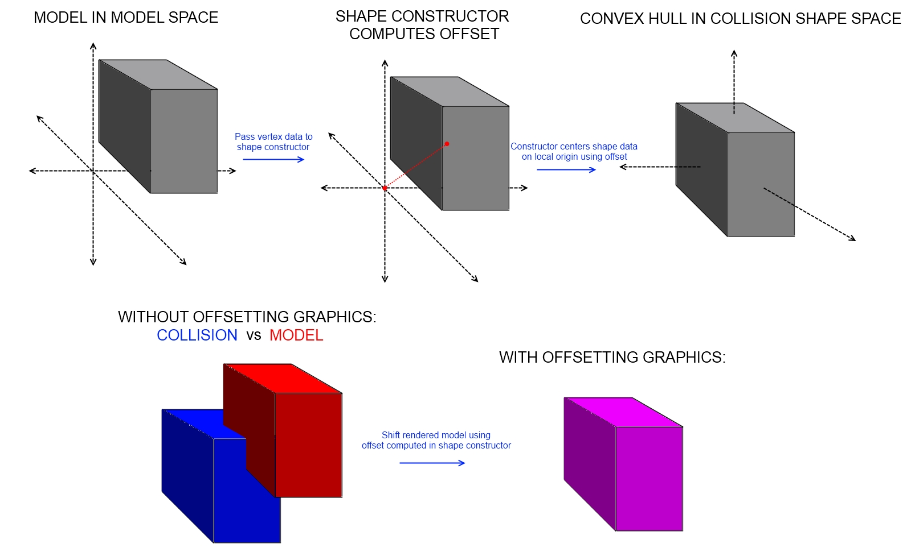

## Collision Shape Recentering

All collision shapes are centered on their local origin. When constructing a more complicated shape from vertices/a model, like a ConvexHullShape or MobileMeshShape, the shape constructor computes the center of mass/volume and offsets all of the shape data so that the center of mass is aligned with the local origin. The constructors for these shapes output the computed position of the data (the value it subtracts from all its vertices to get aligned with the local origin).

{Note: BoxShapes and other trivial shape types are constructed on the center to begin with and no 're'-centering is needed. Since these shapes are approximations, the offset will also be an approximation. The offset can be computed by comparing the bounds (AABB or sphere) of the graphic, making some other measurement, or just by eyeballing it. Once the offset is found, the remaining logic for aligning the graphic to the shape is the same.} 

Because of the recentering operation, the collision shape is no longer aligned with the graphic it was constructed from. When running the simulation, the Entity.WorldTransform is used to pull the shape into world space. If the unmodified graphic is also transformed by the Entity.WorldTransform alone, the graphic and shape will still not be aligned as they weren't aligned to begin with.

In this situation, the graphic will usually appear to 'swing' around the distant center of mass, frequently passing through walls and the floor and behaving very unintuitively. The collision shape itself is behaving normally.

To address this issue, the graphic must be offset in local space such that it aligns properly with the local collision shape. Conveniently, the shape constructors already provided the exact offset needed. 

{Note: If you are using prefab entity types like the ConvexHull or MobileMesh which create their own ConvexHullShape or MobileMeshShape internally, the entity.Position will be the position outputted by the shape constructor. Prefab entity types use that position to put the collision shape in the world space configuration defined by the original data. Be aware that if a constructor that specifies a world position is used to create the prefab entity, the post-construction entity.Position will no longer represent the offset.}

So, create a transform which offsets the target backwards along the computed position, bringing it to the origin. Applying this to the graphic brings the collision shape and graphic into alignment in local space. Then, when the same entity.WorldTransform is applied to both the collision shape and graphic, they will still be in alignment.

The result would look something like:
effect.World = localOffsetTransform * entity.WorldTransform;

Here is a visual showing the problem and the applied solution:

The [GraphicMatchingDemo](../BEPUphysicsDemos/Demos/Extras/GraphicMatchingDemo.cs) can be found in the BEPUphysicsDemos that shows these concepts applied to a convex hull.

Here are some links to forum posts with similar explanations:
* [https://forum.bepuentertainment.com/viewtopic.php?f=4&t=1511](https://forum.bepuentertainment.com/viewtopic.php?f=4&t=1511)
* [https://forum.bepuentertainment.com/viewtopic.php?f=4&t=1516](https://forum.bepuentertainment.com/viewtopic.php?f=4&t=1516)
* [https://forum.bepuentertainment.com/viewtopic.php?f=4&t=1513](https://forum.bepuentertainment.com/viewtopic.php?f=4&t=1513)
* [https://forum.bepuentertainment.com/viewtopic.php?f=4&t=1517](https://forum.bepuentertainment.com/viewtopic.php?f=4&t=1517)

If the origin of the graphic is desired as the origin of rotation for the entity, the entity.CollisionInformation.LocalPosition can be used to offset the collision shape. The graphic and collision shape will once again match and the center of rotation will be wherever the origin was in the model editor. A post about this can be found here:
[https://forum.bepuentertainment.com/viewtopic.php?f=4&t=1494](https://forum.bepuentertainment.com/viewtopic.php?f=4&t=1494)
